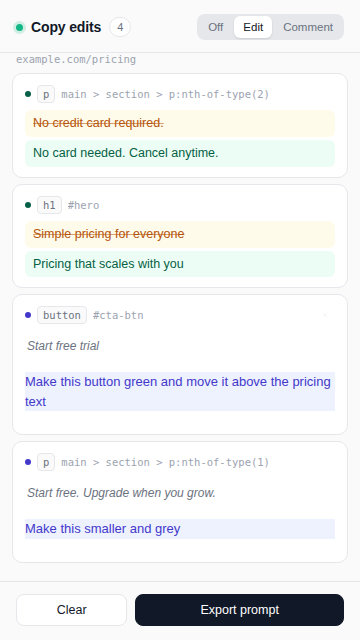

# Live Copy Editor

A tiny Chrome extension for rewriting website copy directly in the browser and handing the result to a coding agent.

Two modes, one log:

- **Edit** — hover any text element to outline it, click to rewrite it in place, press Enter. The before/after is logged.
- **Comment** — hover any element (button, image, section, anything) to outline it, click to attach a note like "remove this" or "make the background blue". The note is logged.

When you're done, **Export prompt** copies a ready-to-paste prompt that tells a coding agent exactly what to change, where, in the source code. Remove any entry you change your mind about before exporting.



## Install

**From the Chrome Web Store** _(once the listing is live)_: click **Add to Chrome**. Updates install automatically.

**Manually, before the listing is live**, which takes about a minute:

1. **Download** [live-copy-editor.zip](https://github.com/matmeylan/live-copy-editor/releases/latest/download/live-copy-editor.zip) and unzip it. Keep the folder somewhere permanent, like Documents.
2. **Open Chrome's extensions page.** Paste `chrome://extensions` into the address bar and press Enter.
3. **Turn on Developer mode.** It's the switch in the top-right corner.
4. **Click "Load unpacked"** (top-left) and pick the unzipped folder.
5. **Pin it.** Click the puzzle-piece icon next to the address bar, then the pin next to *Live Copy Editor*. Clicking the icon opens the side panel.

Chrome loads a manually installed extension from that folder, so moving or deleting it disables the extension. It doesn't auto-update: repeat the download and click the refresh icon on its card in `chrome://extensions`.

Works in Chrome, Edge, Brave and Arc.

## Usage

| Action | How |
| --- | --- |
| Pick a mode | **Off / Edit / Comment** switch in the side panel |
| Edit text | In Edit mode, click any text element on the page, type |
| Save an edit | Press **Enter** or click elsewhere |
| Cancel an edit | Press **Esc** |
| Comment on an element | In Comment mode, click the element, type the note, **⌘/Ctrl+Enter** or **Add** |
| Find an entry on the page | Click the entry in the panel; the element scrolls into view and flashes |
| Remove an entry | Hover the entry, click **×** (a text edit is also reverted on the page) |
| Export | Click **Export prompt**; the prompt is copied to the clipboard |
| Start over | Click **Clear** |

In both modes, links and buttons don't fire, so you can rewrite or annotate them safely.
Editing the same element twice keeps the original text and updates only the new text.

## What the exported prompt looks like

```
You are updating the copy (text content) of a website.
...
## Page: https://example.com/pricing
Title: Pricing – Acme

### Change 1 — text edit
- Page: https://example.com/pricing
- Element: <h1>  (selector: `#hero`)
- Original text:
```
Simple pricing for everyone
```
- New text:
```
Pricing that scales with you
```

### Change 2 — comment
- Page: https://example.com/pricing
- Element: <button>  (selector: `#cta-btn`)
- Current text: "Start free trial"
- Request:
```
Make this button green and move it above the pricing text
```
```

## Development

No build step and no dependencies. Load the repo folder itself with **Load unpacked** and click the refresh icon after each change.

```
scripts/check.sh            # manifest + JS syntax checks
scripts/build.sh [version]  # packages dist/live-copy-editor.zip
```

- `manifest.json` – MV3 manifest (side panel, storage, activeTab, scripting)
- `background.js` – opens the side panel on toolbar click
- `content.js` / `content.css` – hover outlines, in-place editing, comment popover, change logging
- `panel.html` / `panel.css` / `panel.js` – the side panel UI and prompt export

Edits and the active mode are stored in `chrome.storage.local`, so both survive navigation, reloads and new tabs. Every change in the prompt carries its own page URL.

## Releasing

Every push to `main` runs [`.github/workflows/release.yml`](.github/workflows/release.yml):

1. Runs the checks.
2. Builds the zip with version `MAJOR.MINOR.<run number>`, taking `MAJOR.MINOR` from `manifest.json`.
3. Publishes a GitHub Release with the zip attached.
4. Uploads and submits it to the Chrome Web Store for review, if the `CWS_*` secrets are set. Without them the step is skipped with a notice.

Pull requests run steps 1 and 2 only. Bump `MAJOR.MINOR` in `manifest.json` by hand when you want a visible version jump.

Store listing text and permission justifications are in [STORE_LISTING.md](STORE_LISTING.md). The privacy policy is [PRIVACY.md](PRIVACY.md).
